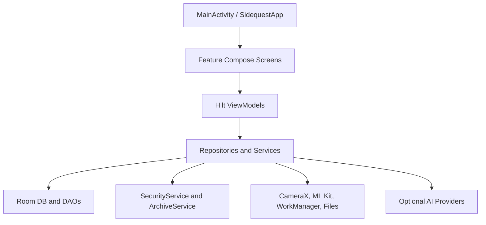
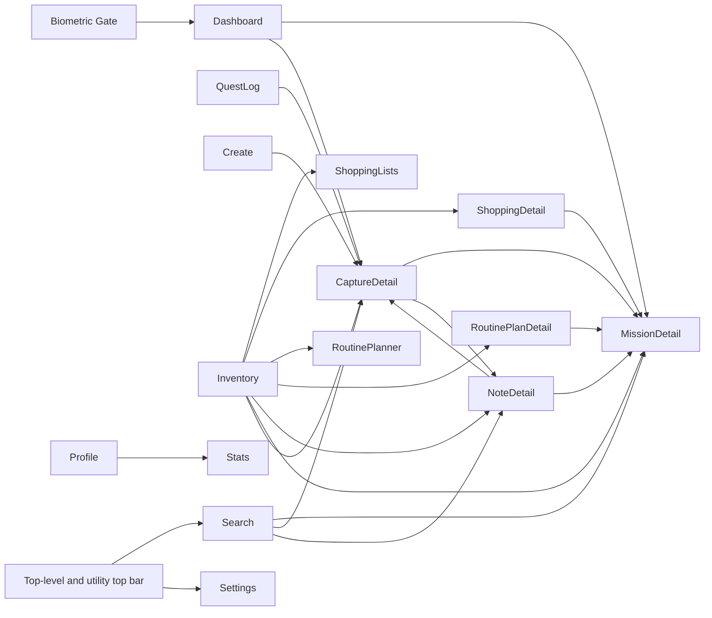
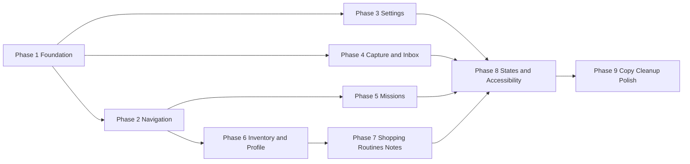
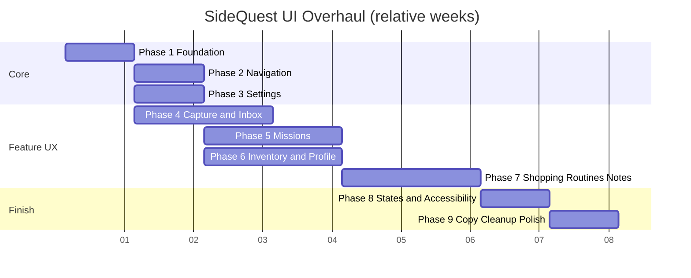

# SideQuest - UI/UX Overhaul Plan

## 1. Application Map

### Screen: Biometric Gate
- File: `app/src/main/java/com/astrogolem/sidequest/MainActivity.kt`
- Entry point: conditional gate before `NavHost` when `userPreferences.biometricLockEnabled`
- Purpose: unlock the app with biometrics before any feature screen is visible
- Reachable from: app launch only
- Tab: none

### Screen: Dashboard
- File: `feature-missions/src/main/java/com/astrogolem/sidequest/feature/missions/MissionsScreen.kt`
- Entry point: route `missions`
- Purpose: review active missions, complete or abandon work, and jump into mission or capture detail
- Reachable from: app start, bottom tab
- Tab: `Dashboard`

### Screen: Mission Detail
- File: `feature-missions/src/main/java/com/astrogolem/sidequest/feature/missions/MissionsScreen.kt`
- Entry point: route `mission/{missionId}`
- Purpose: inspect and edit one mission, including briefing, reminders, rewards, and linked captures
- Reachable from: Dashboard, Capture Detail, Note Detail, Search, Shopping List Detail, Routine Plan Detail, deep links
- Tab: none

### Screen: Quest Log
- File: `feature-inbox/src/main/java/com/astrogolem/sidequest/feature/inbox/InboxScreen.kt`
- Entry point: route `inbox`
- Purpose: triage extraction candidates and recent captures before they become missions or notes
- Reachable from: bottom tab
- Tab: `Quests`

### Screen: Create
- File: `feature-capture/src/main/java/com/astrogolem/sidequest/feature/capture/CaptureScreen.kt`
- Entry point: route `capture`
- Purpose: capture images, run OCR/AI extraction, and enter the post-capture review flow
- Reachable from: bottom tab
- Tab: `Create`

### Screen: Capture Detail
- File: `feature-capture/src/main/java/com/astrogolem/sidequest/feature/capture/CaptureScreen.kt`
- Entry point: route `captureDetail/{captureId}`
- Purpose: inspect one capture, review extracted candidates, and promote data into missions or notes
- Reachable from: Dashboard, Quest Log, Create, Inventory, Note Detail, Search, deep links
- Tab: none

### Screen: Inventory [NEEDS PRODUCT DECISION]
- File: `feature-lobby/src/main/java/com/astrogolem/sidequest/feature/lobby/InventoryStatsScreen.kt`
- Entry point: route `inventory`
- Purpose: mixed archive hub for notes, shopping lists, routine plans, archived missions, and saved scans
- Reachable from: bottom tab
- Tab: `Inventory`

### Screen: Stats
- File: `feature-lobby/src/main/java/com/astrogolem/sidequest/feature/lobby/InventoryStatsScreen.kt`
- Entry point: route `stats`
- Purpose: show aggregate completion metrics and derived wellbeing scores
- Reachable from: Profile
- Tab: none

### Screen: Profile
- File: `feature-lobby/src/main/java/com/astrogolem/sidequest/feature/lobby/LobbyScreen.kt`
- Entry point: route `lobby`
- Purpose: show profile summary, milestones, archive snapshots, and a gateway into stats
- Reachable from: bottom tab
- Tab: `Profile`

### Screen: Note Detail
- File: `feature-lobby/src/main/java/com/astrogolem/sidequest/feature/lobby/NoteDetailScreen.kt`
- Entry point: route `note/{noteId}`
- Purpose: edit or preview a markdown note, open its source capture, or create a mission from the note
- Reachable from: Inventory, Capture Detail, Search
- Tab: none

### Screen: Shopping Lists
- File: `feature-missions/src/main/java/com/astrogolem/sidequest/feature/missions/ShoppingScreen.kt`
- Entry point: route `shopping`
- Purpose: create shopping lists from text, dictation, or photos and browse existing lists
- Reachable from: Inventory
- Tab: none

### Screen: Shopping List Detail
- File: `feature-missions/src/main/java/com/astrogolem/sidequest/feature/missions/ShoppingScreen.kt`
- Entry point: route `shopping/{listId}`
- Purpose: manage one shopping list, archive it, or turn it into a mission
- Reachable from: Shopping Lists, Inventory
- Tab: none

### Screen: Routine Planner
- File: `feature-missions/src/main/java/com/astrogolem/sidequest/feature/missions/RoutinePlannerScreen.kt`
- Entry point: route `routines`
- Purpose: browse routine templates and existing routine plans
- Reachable from: Inventory
- Tab: none

### Screen: Routine Plan Detail
- File: `feature-missions/src/main/java/com/astrogolem/sidequest/feature/missions/RoutinePlannerScreen.kt`
- Entry point: route `routine/{planId}`
- Purpose: edit a routine plan, schedule reminders, complete runs, or create a mission
- Reachable from: Routine Planner, Inventory, deep links
- Tab: none

### Screen: Search
- File: `feature-search/src/main/java/com/astrogolem/sidequest/feature/search/SearchScreen.kt`
- Entry point: route `search`
- Purpose: search across missions, captures, and notes
- Reachable from: top app bar on top-level screens and utility screens
- Tab: none

### Screen: Settings
- File: `feature-settings/src/main/java/com/astrogolem/sidequest/feature/settings/SettingsScreen.kt`
- Entry point: route `settings`
- Purpose: manage appearance, local backups, notes export folder, biometrics, notification permission, and AI provider configuration
- Reachable from: top app bar on top-level screens and utility screens
- Tab: none

## 2. Architecture Overview

## Architecture
- Pattern: modular monolith with MVVM-style presentation and repository/services data access
- Language: Kotlin
- UI layer: Compose
- Navigation: Navigation Compose in a single app-level `NavHost`
- State management: `ViewModel` + `StateFlow` + `collectAsStateWithLifecycle`
- DI: Hilt
- Data layer: Room, WorkManager, CameraX, ML Kit OCR, encrypted/shared preferences, local file storage, optional provider APIs

### Layer Diagram

### Navigation Flowchart

### Feature Overview Table

| Feature | Screen(s) | Status | Notes |
|---|---|---|---|
| Mission board | Dashboard, Mission Detail | Partial | Core flow works, but action hierarchy and scanability are weak. |
| Capture intake | Create, Capture Detail | Partial | Camera and OCR work, but review UX is overloaded and state handling is inconsistent. |
| Inbox triage | Quest Log | Partial | Candidate review exists, but queue structure and action density slow decision-making. |
| Inventory library | Inventory, Note Detail, Shopping Lists, Routine Planner | Partial | Feature breadth is high, but IA is muddled and overloaded. |
| Profile and progression | Profile, Stats | Partial | Metrics exist, but ownership between Profile, Inventory, and Stats is unclear. |
| Search | Search | Partial | Search works, but lacks recent queries, clear states, and stronger result framing. |
| Settings and local trust controls | Settings, Biometric Gate | Partial | Controls exist, but provider setup is too technical and not grouped by user goal. |
| Local backup and restore | Settings | Partial | Export/import exists, but copy does not explain scope, overwrite risk, or success criteria clearly. |
| Provider-backed analysis | Settings, Create, Capture Detail | Partial | Works for OpenAI path, but discoverability and confidence communication are weak. |
| Notifications and reminders | Settings, Routine Plan Detail, Mission Detail | Partial | Permission and reminder logic exist, but setup and status feedback are fragmented. |

## 3. Audit Results

### Biometric Gate
- Mobile UX checklist: thumb reachability `No`; touch targets `Yes`; horizontal scroll `Yes`; readable without zoom `Yes`; loading/empty/error states `No`; back/cancel accessible `No`
- Tab and navigation audit: no tab owner; settings is not reachable in one tap from this gate; recovery path is weaker than the rest of the shell

| Issue | Type | Severity | File | Fix |
|---|---|---|---|---|
| Authentication gate has no visible fallback or help path after biometric failure. | UX | High | `app/src/main/java/com/astrogolem/sidequest/MainActivity.kt` | Add explicit retry, dismiss, and troubleshooting copy with a route back to Settings once unlocked. |
| Gate uses plain centered text and a single button, which breaks the rest of the app's visual hierarchy. | Layout | Med | `app/src/main/java/com/astrogolem/sidequest/MainActivity.kt` | Restyle the gate as a proper entry surface with context, iconography, and safer spacing. |
| User-facing copy is hardcoded in the composable. | Code | Med | `app/src/main/java/com/astrogolem/sidequest/MainActivity.kt` | Move gate copy into `strings.xml` and centralize button labels. |

### Dashboard
- Mobile UX checklist: thumb reachability `Partial`; touch targets `Partial`; horizontal scroll `Yes`; readable without zoom `Partial`; loading/empty/error states `No`; back/cancel accessible `N/A`
- Tab and navigation audit: tab label is only partially self-explanatory because the screen is a mission board, not a generic dashboard; active tab is visually distinct; tab count is acceptable at five; settings is reachable in one tap here

| Issue | Type | Severity | File | Fix |
|---|---|---|---|---|
| Mission cards default to collapsible dense layouts, hiding critical status and next-action cues. | UX | High | `feature-missions/src/main/java/com/astrogolem/sidequest/feature/missions/MissionsScreen.kt` | Expand key mission summary content by default and reserve collapse for secondary metadata. |
| Destructive actions such as abandon are visually close to completion actions. | UX | High | `feature-missions/src/main/java/com/astrogolem/sidequest/feature/missions/MissionsScreen.kt` | Demote destructive controls to overflow or confirmation sheets and keep the main CTA dominant. |
| No search, filter, or sort affordance exists on the main mission board. | UX | Med | `feature-missions/src/main/java/com/astrogolem/sidequest/feature/missions/MissionsScreen.kt` | Add lightweight filters and saved sorting so the board scales beyond a small list. |
| Copy, spacing, and button rows are hardcoded inline throughout the file. | Code | Med | `feature-missions/src/main/java/com/astrogolem/sidequest/feature/missions/MissionsScreen.kt` | Externalize strings and extract repeated card/action rows into `core-ui`. |

### Mission Detail
- Mobile UX checklist: thumb reachability `No`; touch targets `Partial`; horizontal scroll `Yes`; readable without zoom `Partial`; loading/empty/error states `No`; back/cancel accessible `Yes`
- Tab and navigation audit: no tab owner; settings is not reachable in one tap because detail routes do not show the top app bar

| Issue | Type | Severity | File | Fix |
|---|---|---|---|---|
| The screen is a long mixed-form scroll that combines briefing, editing, reminder controls, and destructive actions without sectional hierarchy. | UX | High | `feature-missions/src/main/java/com/astrogolem/sidequest/feature/missions/MissionsScreen.kt` | Break content into sections with sticky primary actions and secondary sheets. |
| Back navigation exists, but there is no one-tap route to Settings or Search from this detail view. | UX | Med | `app/src/main/java/com/astrogolem/sidequest/MainActivity.kt` | Extend the top utility affordances or add a persistent detail toolbar. |
| Repeated button clusters create inconsistent affordance sizing and weak thumb ergonomics. | Layout | Med | `feature-missions/src/main/java/com/astrogolem/sidequest/feature/missions/MissionsScreen.kt` | Convert detail actions into a shared action rail and bottom-sheet patterns. |

### Quest Log
- Mobile UX checklist: thumb reachability `Partial`; touch targets `Partial`; horizontal scroll `Yes`; readable without zoom `Partial`; loading/empty/error states `Partial`; back/cancel accessible `N/A`
- Tab and navigation audit: tab label is understandable but inconsistent with screen title `Quest Log`; active tab is visually distinct; settings is reachable in one tap here

| Issue | Type | Severity | File | Fix |
|---|---|---|---|---|
| Candidate cards are action-heavy and partly collapsed, which slows triage. | UX | High | `feature-inbox/src/main/java/com/astrogolem/sidequest/feature/inbox/InboxScreen.kt` | Make each lane scannable first, then expose secondary actions progressively. |
| Review queue and recent captures live in the same scroll without a strong break. | UX | Med | `feature-inbox/src/main/java/com/astrogolem/sidequest/feature/inbox/InboxScreen.kt` | Separate inbox lanes from history, with clearer headers and sticky summaries. |
| Empty and error states are text-only and visually weak. | UX | Med | `feature-inbox/src/main/java/com/astrogolem/sidequest/feature/inbox/InboxScreen.kt` | Introduce shared state components with actionable next steps. |
| Repeated card styles and hardcoded copy mirror patterns already present in capture and mission screens. | Code | Med | `feature-inbox/src/main/java/com/astrogolem/sidequest/feature/inbox/InboxScreen.kt` | Consolidate queue cards and extract terminology into shared resources. |

### Create
- Mobile UX checklist: thumb reachability `Partial`; touch targets `Partial`; horizontal scroll `Yes`; readable without zoom `Partial`; loading/empty/error states `Partial`; back/cancel accessible `N/A`
- Tab and navigation audit: tab label is clear; active tab is visually distinct; settings is reachable in one tap here

| Issue | Type | Severity | File | Fix |
|---|---|---|---|---|
| The capture footer, AI toggle, and review drawer compete for the same thumb zone. | UX | High | `feature-capture/src/main/java/com/astrogolem/sidequest/feature/capture/CaptureScreen.kt` | Reduce footer options, pin the primary shutter action, and move advanced toggles into a secondary sheet. |
| Permission fallback duplicates messaging and does not transition gracefully back into capture mode. | UX | Med | `feature-capture/src/main/java/com/astrogolem/sidequest/feature/capture/CaptureScreen.kt` | Merge camera permission states into a single guided recovery card. |
| Processing status is mostly communicated through transient banners and dense text. | UX | Med | `feature-capture/src/main/java/com/astrogolem/sidequest/feature/capture/CaptureScreen.kt` | Add persistent in-context processing and review states. |
| `CaptureScreen.kt` is a god file that mixes route, camera logic, review UI, and `ViewModel` behavior. | Code | High | `feature-capture/src/main/java/com/astrogolem/sidequest/feature/capture/CaptureScreen.kt` | Split into capture shell, permission state, review drawer, detail sections, and `ViewModel` helpers. |

### Capture Detail
- Mobile UX checklist: thumb reachability `No`; touch targets `Partial`; horizontal scroll `Yes`; readable without zoom `Partial`; loading/empty/error states `Partial`; back/cancel accessible `Yes`
- Tab and navigation audit: no tab owner; settings is not reachable in one tap

| Issue | Type | Severity | File | Fix |
|---|---|---|---|---|
| Capture detail is an overlong vertical document with weak visual hierarchy between image, candidates, notes, and actions. | UX | High | `feature-capture/src/main/java/com/astrogolem/sidequest/feature/capture/CaptureScreen.kt` | Break the page into sectioned modules with summary chips and anchored actions. |
| Repeated promote/retry/delete/copy actions appear in multiple places with inconsistent visual weight. | UX | High | `feature-capture/src/main/java/com/astrogolem/sidequest/feature/capture/CaptureScreen.kt` | Normalize action placement and use overflow menus for destructive paths. |
| Copy and dimensions are hardcoded throughout candidate sections. | Code | Med | `feature-capture/src/main/java/com/astrogolem/sidequest/feature/capture/CaptureScreen.kt` | Move strings to resources and replace raw spacing values with theme tokens. |

### Inventory
- Mobile UX checklist: thumb reachability `Partial`; touch targets `Partial`; horizontal scroll `Yes`; readable without zoom `Partial`; loading/empty/error states `Partial`; back/cancel accessible `N/A`
- Tab and navigation audit: tab label is understandable, but the feature boundary is not; active tab is visually distinct; settings is reachable in one tap here

| Issue | Type | Severity | File | Fix |
|---|---|---|---|---|
| Inventory is an overloaded mixed-purpose hub with notes, shopping, routines, archived missions, and scans competing equally. | UX | High | `feature-lobby/src/main/java/com/astrogolem/sidequest/feature/lobby/InventoryStatsScreen.kt` | Reframe it as a library with clear primary sections and stronger category ownership. |
| The screen's role overlaps with Profile and Stats, creating IA confusion across three destinations. | UX | High | `feature-lobby/src/main/java/com/astrogolem/sidequest/feature/lobby/InventoryStatsScreen.kt` | Decide whether Inventory is a library-only destination and move personal summary elsewhere. |
| Some strings show encoding artifacts and inconsistent naming. | Copy | High | `feature-lobby/src/main/java/com/astrogolem/sidequest/feature/lobby/InventoryStatsScreen.kt` | Fix file encoding, normalize terminology, and externalize labels. |
| Section cards reuse similar layouts with different naming but no shared components. | Code | Med | `feature-lobby/src/main/java/com/astrogolem/sidequest/feature/lobby/InventoryStatsScreen.kt` | Extract common library section and quick-action composables. |

### Stats
- Mobile UX checklist: thumb reachability `Yes`; touch targets `Yes`; horizontal scroll `Yes`; readable without zoom `Partial`; loading/empty/error states `No`; back/cancel accessible `Yes`
- Tab and navigation audit: no tab owner; settings is reachable in one tap because stats is a utility route with top app bar

| Issue | Type | Severity | File | Fix |
|---|---|---|---|---|
| Derived wellbeing metrics have no visible formula explanation or confidence framing. | UX | High | `feature-lobby/src/main/java/com/astrogolem/sidequest/feature/lobby/InventoryStatsScreen.kt` | Add metric definitions, source data references, and trend context. |
| The screen is read-only but offers little comparative history or "what changed" feedback. | UX | Med | `feature-lobby/src/main/java/com/astrogolem/sidequest/feature/lobby/InventoryStatsScreen.kt` | Add compact trend deltas and last-updated context. |
| Labels and layout spacing are hardcoded inline. | Code | Low | `feature-lobby/src/main/java/com/astrogolem/sidequest/feature/lobby/InventoryStatsScreen.kt` | Move reusable metric copy and spacing into theme/resources. |

### Profile
- Mobile UX checklist: thumb reachability `Partial`; touch targets `Yes`; horizontal scroll `Yes`; readable without zoom `Partial`; loading/empty/error states `No`; back/cancel accessible `N/A`
- Tab and navigation audit: tab label is self-explanatory, but the screen overlaps with Inventory and Stats; settings is reachable in one tap here

| Issue | Type | Severity | File | Fix |
|---|---|---|---|---|
| Profile duplicates progression and archive concepts that already appear elsewhere. | UX | High | `feature-lobby/src/main/java/com/astrogolem/sidequest/feature/lobby/LobbyScreen.kt` | Narrow Profile to personal identity and high-level progress only. |
| `Open Stats` appears as an isolated action instead of a clear information architecture path. | UX | Med | `feature-lobby/src/main/java/com/astrogolem/sidequest/feature/lobby/LobbyScreen.kt` | Promote stats as a secondary navigation section or fold the summary inline. |
| Card composition patterns repeat without a shared design system wrapper. | Code | Low | `feature-lobby/src/main/java/com/astrogolem/sidequest/feature/lobby/LobbyScreen.kt` | Extract profile summary and milestone blocks into `core-ui`. |

### Note Detail
- Mobile UX checklist: thumb reachability `Partial`; touch targets `Partial`; horizontal scroll `Yes`; readable without zoom `Yes`; loading/empty/error states `Partial`; back/cancel accessible `Yes`
- Tab and navigation audit: no tab owner; settings is reachable in one tap because note detail is a utility route with top app bar

| Issue | Type | Severity | File | Fix |
|---|---|---|---|---|
| Save, delete, create mission, and open source capture are clustered without clear priority. | UX | High | `feature-lobby/src/main/java/com/astrogolem/sidequest/feature/lobby/NoteDetailScreen.kt` | Separate primary editor actions from destructive and conversion actions. |
| Preview toggle and editor state are understandable, but the screen lacks a clearer draft/saved status. | UX | Med | `feature-lobby/src/main/java/com/astrogolem/sidequest/feature/lobby/NoteDetailScreen.kt` | Add a persistent save state and inline preview affordance. |
| Strings are hardcoded directly in the composable. | Code | Low | `feature-lobby/src/main/java/com/astrogolem/sidequest/feature/lobby/NoteDetailScreen.kt` | Move labels into `strings.xml`. |

### Shopping Lists
- Mobile UX checklist: thumb reachability `No`; touch targets `Yes`; horizontal scroll `Yes`; readable without zoom `Yes`; loading/empty/error states `Partial`; back/cancel accessible `Yes`
- Tab and navigation audit: no tab owner; settings is reachable in one tap because shopping is a utility route with top app bar

| Issue | Type | Severity | File | Fix |
|---|---|---|---|---|
| Text, dictation, and photo list creation all compete inside one dense creation block. | UX | High | `feature-missions/src/main/java/com/astrogolem/sidequest/feature/missions/ShoppingScreen.kt` | Split list creation into a single chooser step and separate creation flows. |
| Manual list inputs dominate the initial viewport, pushing existing lists below the fold. | UX | Med | `feature-missions/src/main/java/com/astrogolem/sidequest/feature/missions/ShoppingScreen.kt` | Prioritize recent lists and move creation into a staged flow. |
| Repeated creation buttons and labels are hardcoded. | Code | Med | `feature-missions/src/main/java/com/astrogolem/sidequest/feature/missions/ShoppingScreen.kt` | Extract source pickers and labels into shared resources. |

### Shopping List Detail
- Mobile UX checklist: thumb reachability `Partial`; touch targets `Yes`; horizontal scroll `Yes`; readable without zoom `Yes`; loading/empty/error states `Partial`; back/cancel accessible `Yes`
- Tab and navigation audit: no tab owner; settings is reachable in one tap because this is a utility route

| Issue | Type | Severity | File | Fix |
|---|---|---|---|---|
| Title edit, save, archive, create mission, and delete are stacked too tightly at the top. | UX | High | `feature-missions/src/main/java/com/astrogolem/sidequest/feature/missions/ShoppingScreen.kt` | Move secondary and destructive controls into overflow or a bottom sheet. |
| The checklist lacks fast inline add/edit patterns. | UX | Med | `feature-missions/src/main/java/com/astrogolem/sidequest/feature/missions/ShoppingScreen.kt` | Add thumb-friendly inline item creation and editing. |
| Labels and spacing are hardcoded directly in the file. | Code | Low | `feature-missions/src/main/java/com/astrogolem/sidequest/feature/missions/ShoppingScreen.kt` | Externalize strings and tokenized dimensions. |

### Routine Planner
- Mobile UX checklist: thumb reachability `No`; touch targets `Partial`; horizontal scroll `Yes`; readable without zoom `Yes`; loading/empty/error states `Partial`; back/cancel accessible `Yes`
- Tab and navigation audit: no tab owner; settings is reachable in one tap because this is a utility route

| Issue | Type | Severity | File | Fix |
|---|---|---|---|---|
| Template catalog overwhelms the user before existing plans or quick actions. | UX | High | `feature-missions/src/main/java/com/astrogolem/sidequest/feature/missions/RoutinePlannerScreen.kt` | Lead with active plans and collapse template discovery behind an explicit action. |
| Repeated `Use template` cards create visual fatigue and duplicated layout logic. | UX | Med | `feature-missions/src/main/java/com/astrogolem/sidequest/feature/missions/RoutinePlannerScreen.kt` | Replace long template rows with grouped categories and reusable template cells. |
| Hardcoded strings and duplicated composable structure increase maintenance cost. | Code | Med | `feature-missions/src/main/java/com/astrogolem/sidequest/feature/missions/RoutinePlannerScreen.kt` | Split planner list, template gallery, and plan form into smaller composables. |

### Routine Plan Detail
- Mobile UX checklist: thumb reachability `No`; touch targets `Partial`; horizontal scroll `Yes`; readable without zoom `Partial`; loading/empty/error states `Partial`; back/cancel accessible `Yes`
- Tab and navigation audit: no tab owner; settings is reachable in one tap because this is a utility route

| Issue | Type | Severity | File | Fix |
|---|---|---|---|---|
| The form exposes too many implementation details in one dense scroll. | UX | High | `feature-missions/src/main/java/com/astrogolem/sidequest/feature/missions/RoutinePlannerScreen.kt` | Break routine editing into sections with progressive disclosure. |
| Save, complete, create mission, and delete compete at the same visual level. | UX | High | `feature-missions/src/main/java/com/astrogolem/sidequest/feature/missions/RoutinePlannerScreen.kt` | Create a sticky save CTA and hide destructive paths behind confirmation. |
| Button rows and form labels are repeated across planner states. | Code | Med | `feature-missions/src/main/java/com/astrogolem/sidequest/feature/missions/RoutinePlannerScreen.kt` | Extract shared routine form sections and action bars. |

### Search
- Mobile UX checklist: thumb reachability `Partial`; touch targets `Yes`; horizontal scroll `Yes`; readable without zoom `Yes`; loading/empty/error states `Partial`; back/cancel accessible `Yes`
- Tab and navigation audit: no tab owner; settings is reachable in one tap because search is a utility route

| Issue | Type | Severity | File | Fix |
|---|---|---|---|---|
| Search has no recent searches, saved filters, or stronger empty/loading guidance. | UX | Med | `feature-search/src/main/java/com/astrogolem/sidequest/feature/search/SearchScreen.kt` | Add recent query history and richer state components. |
| Result categories are functional but not strongly differentiated. | UX | Low | `feature-search/src/main/java/com/astrogolem/sidequest/feature/search/SearchScreen.kt` | Improve chip hierarchy and item subtitles. |
| All user-facing strings are hardcoded. | Code | Low | `feature-search/src/main/java/com/astrogolem/sidequest/feature/search/SearchScreen.kt` | Move labels and placeholders into resources. |

### Settings
- Mobile UX checklist: thumb reachability `No`; touch targets `Partial`; horizontal scroll `Yes`; readable without zoom `Yes`; loading/empty/error states `Partial`; back/cancel accessible `Yes`
- Tab and navigation audit: no tab owner; settings is reachable in one tap only from top-level and utility routes, not from mission or capture detail

| Issue | Type | Severity | File | Fix |
|---|---|---|---|---|
| Settings are grouped by implementation detail instead of user goals such as privacy, backups, notes, AI, and appearance. | UX | High | `feature-settings/src/main/java/com/astrogolem/sidequest/feature/settings/SettingsScreen.kt` | Reorganize sections around user intent and collapse advanced provider setup. |
| Provider activation and API key storage behavior are not self-explanatory to a mobile user. | Copy | High | `feature-settings/src/main/java/com/astrogolem/sidequest/feature/settings/SettingsScreen.kt` | Replace technical copy with explicit outcomes, scopes, and trust boundaries. |
| `Device Readiness` is diagnostics content, not a user setting. | UX | Med | `feature-settings/src/main/java/com/astrogolem/sidequest/feature/settings/SettingsScreen.kt` | Move readiness checks into a support/about section or a separate diagnostics surface. |
| The screen hardcodes nearly all labels and spacing values. | Code | Med | `feature-settings/src/main/java/com/astrogolem/sidequest/feature/settings/SettingsScreen.kt` | Externalize strings and introduce shared settings row tokens. |

### Global Issues Table

| Issue | Severity | Evidence | Recommended fix |
|---|---|---|---|
| Information architecture is unclear across Dashboard, Quest Log, Inventory, and Profile. | High | Route ownership is spread across `MainActivity.kt`, `InventoryStatsScreen.kt`, `LobbyScreen.kt`, and `MissionsScreen.kt`. | Re-label tabs, clarify destination purpose, and reduce overlap between library, progress, and work queues. |
| Terminology drifts between missions, quests, captures, scans, intel, notes, and routines. | High | Inconsistent labels across feature files and tab names. | Define a single content language and externalize copy into shared resources. |
| Hardcoded strings dominate the UI; `app/src/main/res/values/strings.xml` only contains `app_name`. | High | Every feature screen uses inline strings. | Run a full string extraction pass before copy polish ships. |
| There is no consistent loading, empty, or error component system. | High | Most screens use bare text or banners. | Add shared state surfaces in `core-ui` and adopt them everywhere. |
| Several screens are oversized god files. | High | `CaptureScreen.kt`, `MissionsScreen.kt`, `RoutinePlannerScreen.kt`, and `InventoryStatsScreen.kt` mix route, state, and UI. | Split by screen shell, feature sections, and shared components. |
| Destructive and secondary actions often compete with the primary CTA. | High | Mission, capture, shopping, note, and routine detail screens all show this problem. | Normalize action hierarchy with shared primary/secondary/destructive patterns. |
| Settings is too technical for a mobile-first app. | High | Provider setup, readiness, notes folder, and backup copy are mixed together. | Reorganize settings by user goal and hide advanced provider management behind clear labels. |
| Design tokens are incomplete and inconsistently applied. | Med | No `dimens.xml`; repeated raw `dp` values and ad-hoc type choices across modules. | Introduce shared spacing, sizing, and settings row tokens in `core-ui`. |
| Expected mobile interaction patterns are missing. | Med | No pull-to-refresh, swipe-to-dismiss, haptic feedback, or strong confirmation patterns. | Add consistent system feedback patterns in the shared component layer. |
| Lint is not release-clean. | Med | `:app:lintDebug` fails on WorkManager initializer and camera feature declarations; warnings include unused assets and resource issues. | Fix manifest blockers, remove unused resources, and keep lint green during the cleanup phase. |

## 4. Settings Audit Detail

### Current Settings Inventory

| Current label | Control type | Self-explanatory | Audit note |
|---|---|---|---|
| `solar` | single-select button | Partial | Label is only a palette name; needs appearance context and preview copy. |
| `aether` | single-select button | Partial | Same issue as above. |
| `frost` | single-select button | Partial | Same issue as above. |
| `hearth` | single-select button | Partial | Same issue as above. |
| `cyber` | single-select button | Partial | Same issue as above and it currently feels like the implicit default rather than a user choice. |
| `Export Snapshot` | button | Partial | "Snapshot" does not clearly communicate local backup scope, file contents, or overwrite behavior. |
| `Import Snapshot` | button | Partial | Needs restore warnings and a success summary. |
| `Biometric lock` | switch | Yes | Belongs under Privacy or App Security. |
| `Notifications` | status text | Partial | Current label is a heading, not a setting row; needs clear action wording. |
| `Grant notifications` | button | Yes | Should be nested under a clearer alert/reminder section. |
| `Choose folder` / `Change folder` | button | Partial | User intent is clear only after reading the explanatory paragraph. |
| `Clear` | text button | Partial | Needs destructive confirmation and better wording such as "Disconnect folder." |
| `OPENAI` | card title | Partial | Works for advanced users only; should be framed as an optional provider. |
| `AI provider active` for OpenAI | switch | No | Replace with explicit phrasing such as "Use OpenAI for capture analysis." |
| `OPENAI API key` | password field | Partial | Understandable for technical users, but needs trust and storage explanation. |
| `Add key` / `Edit key` / `Save key` / `Cancel` for OpenAI | buttons | Partial | Action labels are fine, but they need clearer success/error feedback. |
| `ANTHROPIC` | card title | Partial | Same issue as OpenAI. |
| `AI provider active` for Anthropic | switch | No | Same issue as OpenAI. |
| `ANTHROPIC API key` | password field | Partial | Same issue as OpenAI. |
| `Add key` / `Edit key` / `Save key` / `Cancel` for Anthropic | buttons | Partial | Same issue as OpenAI. |
| `NIM` | card title | No | Acronym is too opaque for most users. |
| `AI provider active` for NIM | switch | No | Same issue as OpenAI. |
| `NIM API key` | password field | No | Needs provider explanation before the field. |
| `Add key` / `Edit key` / `Save key` / `Cancel` for NIM | buttons | Partial | Same issue as OpenAI. |
| `OPENROUTER` | card title | No | Too technical without context. |
| `AI provider active` for OpenRouter | switch | No | Same issue as OpenAI. |
| `OPENROUTER API key` | password field | Partial | Needs trust and billing context. |
| `Add key` / `Edit key` / `Save key` / `Cancel` for OpenRouter | buttons | Partial | Same issue as OpenAI. |
| `Device Readiness` | diagnostics card | No | This is not a setting and should move to a support/about location. |
| `Camera permission: granted/missing` | read-only text | Yes | Keep as diagnostics, not settings. |
| `Notification permission: granted/missing` | read-only text | Yes | Keep as diagnostics, not settings. |
| `Biometric lock: enabled/disabled` | read-only text | Yes | Redundant with the actual switch above. |
| `Offline-first storage: local DB active` | read-only text | Partial | Better as static product copy, not a settings row. |

### Settings Regrouping Recommendations
- Appearance: theme preset selection with named previews and short descriptions.
- Privacy and Security: biometric lock, local storage explanation, backup/restore.
- Alerts and Reminders: notification permission and reminder readiness.
- Notes and Exports: external notes folder connection, export, import, restore warnings.
- AI Analysis: provider introduction, provider choice, API key management, local-only fallback.
- Support and Diagnostics: device readiness, permission state, and storage health.

## 5. 9-Phase Plan

### Phase Dependency Diagram

### Gantt Chart

Relative baseline: Week 1 starts at the synthetic planning anchor `2026-01-05`.

### Phase 1: Foundation

**Goal:** establish a reusable token and component baseline so later UI changes stop duplicating copy, spacing, and action patterns.
**Completion criterion:** all core UI primitives needed by the overhaul exist in `core-ui`, and new work no longer introduces raw strings or ad-hoc action rows in audited screens.
**Effort:** L
**Prerequisite phases:** none

**Included work:**

| Task | Area | Effort | Files |
|---|---|---|---|
| Externalize UI copy and spacing tokens | Code | M | `app/src/main/res/values/strings.xml`, `core-ui/src/main/java/com/astrogolem/sidequest/core/ui/theme/*`, all feature screen files |
| Extract shared cards, action rows, and state shells | UX | L | `core-ui/src/main/java/com/astrogolem/sidequest/core/ui/components/*`, `feature-*/*Screen.kt` |

### Phase 2: Navigation and Tab Overhaul

**Goal:** make every top-level destination self-explanatory and keep navigation utilities predictable.
**Completion criterion:** top-level labels, titles, and detail-screen utility access are coherent, and every destination has a clear single-sentence purpose.
**Effort:** M
**Prerequisite phases:** Phase 1

**Included work:**

| Task | Area | Effort | Files |
|---|---|---|---|
| Rename top-level tabs and titles to match screen purpose | Copy | S | `app/src/main/java/com/astrogolem/sidequest/MainActivity.kt`, feature headers |
| Add persistent detail-screen utility access | UX | M | `app/src/main/java/com/astrogolem/sidequest/MainActivity.kt`, affected detail screens |

### Phase 3: Settings Redesign

**Goal:** turn Settings into a trust-building mobile settings surface rather than a developer console.
**Completion criterion:** settings are grouped by user goal, advanced provider configuration is understandable, and diagnostics are separated from settings.
**Effort:** L
**Prerequisite phases:** Phase 1

**Included work:**

| Task | Area | Effort | Files |
|---|---|---|---|
| Reorganize settings by user goal | UX | M | `feature-settings/src/main/java/com/astrogolem/sidequest/feature/settings/SettingsScreen.kt` |
| Clarify provider, backup, and notes-folder trust boundaries | Copy | M | `feature-settings/src/main/java/com/astrogolem/sidequest/feature/settings/SettingsScreen.kt`, `strings.xml` |

### Phase 4: Capture and Inbox UX Fixes

**Goal:** make intake, OCR review, and queue triage fast enough to use one-handed under real mobile conditions.
**Completion criterion:** capture flow has one dominant primary action, review status is persistent, and inbox triage lanes are scannable without expanding every card.
**Effort:** XL
**Prerequisite phases:** Phase 1

**Included work:**

| Task | Area | Effort | Files |
|---|---|---|---|
| Simplify capture controls and permission recovery | UX | L | `feature-capture/src/main/java/com/astrogolem/sidequest/feature/capture/CaptureScreen.kt` |
| Turn Quest Log into a clear triage workspace | UX | L | `feature-inbox/src/main/java/com/astrogolem/sidequest/feature/inbox/InboxScreen.kt`, `feature-capture/.../CaptureScreen.kt` |

### Phase 5: Mission Workflow Fixes

**Goal:** make mission planning and mission detail readable, safe, and action-oriented.
**Completion criterion:** active missions are glanceable from the board, and mission detail exposes one clear primary path at a time.
**Effort:** XL
**Prerequisite phases:** Phase 2

**Included work:**

| Task | Area | Effort | Files |
|---|---|---|---|
| Rebalance mission board hierarchy and safety cues | UX | M | `feature-missions/src/main/java/com/astrogolem/sidequest/feature/missions/MissionsScreen.kt` |
| Section mission detail into modular action areas | UX | L | `feature-missions/src/main/java/com/astrogolem/sidequest/feature/missions/MissionsScreen.kt` |

### Phase 6: Inventory, Profile, and Stats IA Cleanup

**Goal:** clarify the difference between personal progress, archived assets, and analytics.
**Completion criterion:** Inventory, Profile, and Stats each own a distinct purpose with no duplicate entrypoint confusion.
**Effort:** L
**Prerequisite phases:** Phase 2

**Included work:**

| Task | Area | Effort | Files |
|---|---|---|---|
| Reframe Inventory as a library hub | UX | L | `feature-lobby/src/main/java/com/astrogolem/sidequest/feature/lobby/InventoryStatsScreen.kt` |
| Narrow Profile and explain Stats metrics | UX | M | `feature-lobby/src/main/java/com/astrogolem/sidequest/feature/lobby/LobbyScreen.kt`, `feature-lobby/.../InventoryStatsScreen.kt` |

### Phase 7: Shopping, Routine, and Note Flow Cleanup

**Goal:** reduce form fatigue across the non-mission productivity tools.
**Completion criterion:** shopping, routine, and note flows use staged actions, clearer action priority, and smaller reusable sections.
**Effort:** L
**Prerequisite phases:** Phase 6

**Included work:**

| Task | Area | Effort | Files |
|---|---|---|---|
| Split shopping creation from shopping management | UX | M | `feature-missions/src/main/java/com/astrogolem/sidequest/feature/missions/ShoppingScreen.kt` |
| Simplify routine and note detail action hierarchy | UX | L | `feature-missions/src/main/java/com/astrogolem/sidequest/feature/missions/RoutinePlannerScreen.kt`, `feature-lobby/.../NoteDetailScreen.kt` |

### Phase 8: States and Accessibility Pass

**Goal:** make every surface resilient under loading, empty, error, and impaired-use conditions.
**Completion criterion:** all audited screens implement shared loading/empty/error states, 48dp targets, accessible semantics, and predictable feedback.
**Effort:** L
**Prerequisite phases:** Phases 3, 4, 5, and 7

**Included work:**

| Task | Area | Effort | Files |
|---|---|---|---|
| Roll out shared loading, empty, and error states | UX | M | `core-ui/src/main/java/com/astrogolem/sidequest/core/ui/components/*`, all feature screens |
| Enforce touch targets, semantics, and recovery affordances | UX | M | all feature screens, `MainActivity.kt` |

### Phase 9: Copy, Cleanup, and Polish

**Goal:** ship a cleaner, more coherent app that is release-ready from both UX and code hygiene perspectives.
**Completion criterion:** terminology is consistent, dead code and unused assets are removed, lint passes, and motion/haptic polish is applied only where it improves feedback.
**Effort:** L
**Prerequisite phases:** Phase 8

**Included work:**

| Task | Area | Effort | Files |
|---|---|---|---|
| Normalize terminology and microcopy across the app | Copy | M | `strings.xml`, all feature screens |
| Remove dead UI code, fix lint blockers, and add restrained polish | Code | M | `MainActivity.kt`, feature screens, `AndroidManifest.xml`, app resources |

## 6. Full Task List

### Task: Externalize UI copy and spacing tokens
**Phase:** 1
**Area:** Code
**Description:** Move user-facing text out of inline composables and introduce a reusable spacing/sizing token surface in `core-ui`. Touch `app/src/main/res/values/strings.xml`, the theme package in `core-ui`, and every audited feature file that currently hardcodes copy or raw spacing values.
**Acceptance criteria:**
- [ ] `strings.xml` contains the labels currently hardcoded in the audited screens.
- [ ] Shared spacing or sizing tokens replace repeated raw values for the main layout patterns used in settings, cards, and action rows.
**Effort:** M
**Depends on:** none
**Do NOT:** redesign flows or rename routes in this task.

### Task: Extract shared cards, action rows, and state shells
**Phase:** 1
**Area:** UX
**Description:** Build a minimal shared component kit in `core-ui` for section cards, primary/secondary/destructive action rows, and reusable loading/empty/error shells. The goal is to stop each feature module from hand-rolling similar cards and button clusters.
**Acceptance criteria:**
- [ ] Shared components exist in `core-ui` and are used by at least one representative screen from capture, missions, and settings.
- [ ] New action rows visibly distinguish primary, secondary, and destructive actions without custom per-screen styling.
**Effort:** L
**Depends on:** Externalize UI copy and spacing tokens
**Do NOT:** migrate every screen in one pass; establish the primitives only.

### Task: Rename top-level tabs and titles to match screen purpose
**Phase:** 2
**Area:** Copy
**Description:** Audit the tab labels in `MainActivity.kt` against the actual screen purpose and align top bar titles with the destination users land on. This should eliminate current drift such as `Quests` vs `Quest Log` and reduce vague naming like `Dashboard`.
**Acceptance criteria:**
- [ ] Each top-level tab label is understandable without its icon.
- [ ] Top app bar titles and bottom-tab labels use the same noun for the same destination.
**Effort:** S
**Depends on:** Externalize UI copy and spacing tokens
**Do NOT:** add or remove routes in this task.

### Task: Add persistent detail-screen utility access
**Phase:** 2
**Area:** UX
**Description:** Extend the app shell so mission and capture detail routes retain access to utility actions such as Settings and Search without forcing a back-navigation hop. Update `MainActivity.kt` and any affected screen wrappers only.
**Acceptance criteria:**
- [ ] Mission Detail and Capture Detail expose back navigation plus utility access in a consistent top area.
- [ ] Utility access stays visually subordinate to the primary task on detail screens.
**Effort:** M
**Depends on:** Rename top-level tabs and titles to match screen purpose
**Do NOT:** change deep-link contracts or screen destinations.

### Task: Reorganize settings by user goal
**Phase:** 3
**Area:** UX
**Description:** Rebuild `SettingsScreen.kt` into user-goal sections: Appearance, Privacy and Security, Alerts and Reminders, Notes and Exports, AI Analysis, and Support/Diagnostics. The same controls should remain available, but the grouping and density need to become mobile-friendly.
**Acceptance criteria:**
- [ ] Every existing setting still exists after the redesign.
- [ ] `Device Readiness` is no longer presented as a primary settings section.
**Effort:** M
**Depends on:** Extract shared cards, action rows, and state shells
**Do NOT:** change provider APIs, storage contracts, or backup file formats.

### Task: Clarify provider, backup, and notes-folder trust boundaries
**Phase:** 3
**Area:** Copy
**Description:** Rewrite settings copy so a mobile user can understand what is stored locally, when a provider is used, what backup/restore changes, and what the notes folder connection does. Keep the same logic, but remove developer-centric phrasing and ambiguous terms.
**Acceptance criteria:**
- [ ] Provider activation rows explicitly state the outcome of turning them on.
- [ ] Backup, restore, and notes-folder copy explain scope and side effects in plain language.
**Effort:** M
**Depends on:** Reorganize settings by user goal
**Do NOT:** add new providers or billing flows.

### Task: Simplify capture controls and permission recovery
**Phase:** 4
**Area:** UX
**Description:** Reduce the control competition in `CaptureScreen.kt` by giving the shutter/review path one dominant primary action, moving advanced toggles out of the thumb hot zone, and merging permission recovery into a single guided state. Keep camera, OCR, and AI behavior intact.
**Acceptance criteria:**
- [ ] The primary capture action is the most visually dominant control in the footer.
- [ ] Camera permission denial resolves through one clear recovery surface instead of duplicated messaging.
**Effort:** L
**Depends on:** Extract shared cards, action rows, and state shells
**Do NOT:** change capture processing logic or provider contracts.

### Task: Turn Quest Log into a clear triage workspace
**Phase:** 4
**Area:** UX
**Description:** Refactor `InboxScreen.kt` so review lanes are scannable before expansion and recent history is visually separated from active triage. The screen should feel like a queue, not a mixed timeline.
**Acceptance criteria:**
- [ ] Review-ready items can be triaged without expanding every card.
- [ ] Recent captures are visually separated from active candidate queues.
**Effort:** L
**Depends on:** Extract shared cards, action rows, and state shells
**Do NOT:** add new extraction kinds or change inbox data semantics.

### Task: Rebalance mission board hierarchy and safety cues
**Phase:** 5
**Area:** UX
**Description:** Redesign the mission board portion of `MissionsScreen.kt` so active missions are glanceable, destructive actions are demoted, and the user can understand status without opening every item. This is the high-level mission dashboard pass only.
**Acceptance criteria:**
- [ ] Mission status, due context, and next action are readable at card glance level.
- [ ] Destructive mission actions no longer compete with the main CTA.
**Effort:** M
**Depends on:** Rename top-level tabs and titles to match screen purpose
**Do NOT:** redesign mission detail in this task.

### Task: Section mission detail into modular action areas
**Phase:** 5
**Area:** UX
**Description:** Break mission detail inside `MissionsScreen.kt` into discrete sections for overview, scheduling, linked captures, and destructive/secondary actions. Use sticky or anchored action treatment so one-handed editing is less error-prone.
**Acceptance criteria:**
- [ ] Mission detail no longer presents all primary and destructive actions in the same visual block.
- [ ] The main save/complete path remains visible without requiring the user to scan the full page.
**Effort:** L
**Depends on:** Rebalance mission board hierarchy and safety cues
**Do NOT:** change mission fields or reminder logic.

### Task: Reframe Inventory as a library hub
**Phase:** 6
**Area:** UX
**Description:** Restructure `InventoryStatsScreen.kt` so Inventory owns saved assets and archives, not personal progress or ambiguous mixed summaries. Notes, routines, shopping, archived missions, and captures should become clearly named library sections with stronger hierarchy.
**Acceptance criteria:**
- [ ] Each Inventory section has a distinct label and purpose.
- [ ] Inventory no longer reads like a second profile or second dashboard.
**Effort:** L
**Depends on:** Rename top-level tabs and titles to match screen purpose
**Do NOT:** remove any asset type from Inventory without a documented product decision.

### Task: Narrow Profile and explain Stats metrics
**Phase:** 6
**Area:** UX
**Description:** Update `LobbyScreen.kt` and the stats portion of `InventoryStatsScreen.kt` so Profile becomes a personal summary surface while Stats explains derived metrics with clearer source context. This should eliminate current role overlap between Profile, Inventory, and Stats.
**Acceptance criteria:**
- [ ] Profile focuses on identity, milestones, and high-level progress only.
- [ ] Stats includes plain-language explanations of what each derived metric means.
**Effort:** M
**Depends on:** Reframe Inventory as a library hub
**Do NOT:** change the underlying stats formulas in this task.

### Task: Split shopping creation from shopping management
**Phase:** 7
**Area:** UX
**Description:** Separate creation entrypoints in `ShoppingScreen.kt` from the list-management experience so the user first picks a creation mode, then completes that mode in a focused flow. Existing list browsing should become easier to reach from the initial viewport.
**Acceptance criteria:**
- [ ] Shopping list creation no longer presents text, dictation, and photo flows in the same dense block.
- [ ] Existing shopping lists are visible without scrolling past a long form.
**Effort:** M
**Depends on:** Reframe Inventory as a library hub
**Do NOT:** change shopping data models or archive behavior.

### Task: Simplify routine and note detail action hierarchy
**Phase:** 7
**Area:** UX
**Description:** Apply the same action-priority cleanup to `RoutinePlannerScreen.kt` and `NoteDetailScreen.kt` so save/complete flows are clear and destructive or conversion actions are secondary. Also reduce form density where routine editing currently exposes too many controls at once.
**Acceptance criteria:**
- [ ] Routine Plan Detail has one obvious save/complete path and hidden destructive actions.
- [ ] Note Detail separates editing actions from create-mission and delete actions.
**Effort:** L
**Depends on:** Narrow Profile and explain Stats metrics
**Do NOT:** modify reminder scheduling logic or note storage behavior.

### Task: Roll out shared loading, empty, and error states
**Phase:** 8
**Area:** UX
**Description:** Use the new shared shells from `core-ui` to give every audited screen a proper loading, empty, and error experience. The pass should cover capture, inbox, mission, inventory, shopping, routine, search, and settings surfaces.
**Acceptance criteria:**
- [ ] Each audited screen has explicit loading, empty, and error UI where asynchronous data is present.
- [ ] State surfaces include at least one relevant next action instead of plain status text.
**Effort:** M
**Depends on:** Simplify capture controls and permission recovery, Turn Quest Log into a clear triage workspace, Section mission detail into modular action areas, Simplify routine and note detail action hierarchy
**Do NOT:** invent new backend error codes or change repository behavior.

### Task: Enforce touch targets, semantics, and recovery affordances
**Phase:** 8
**Area:** UX
**Description:** Perform an accessibility pass across the app so touch targets meet 48dp expectations, content descriptions and semantics are meaningful, and cancel/back/retry actions are always discoverable. Include haptic feedback only where it supports confirmation or capture confidence.
**Acceptance criteria:**
- [ ] Primary interactive targets on the audited screens meet 48dp minimum size or spacing intent.
- [ ] Every error or blocked state includes a clear retry, back, or cancel path.
**Effort:** M
**Depends on:** Roll out shared loading, empty, and error states
**Do NOT:** add ornamental motion or haptics that do not reinforce a user action.

### Task: Normalize terminology and microcopy across the app
**Phase:** 9
**Area:** Copy
**Description:** Standardize the nouns used for missions, quests, captures, scans, intel, notes, and routines across tabs, headers, cards, and settings. The objective is a single coherent product language, not a theme rewrite.
**Acceptance criteria:**
- [ ] The same object uses the same label across tabs, headers, and detail screens.
- [ ] Settings, capture, inbox, and inventory copy no longer require prior repo knowledge to understand.
**Effort:** M
**Depends on:** Roll out shared loading, empty, and error states
**Do NOT:** rename database entities or API fields.

### Task: Remove dead UI code, fix lint blockers, and add restrained polish
**Phase:** 9
**Area:** Code
**Description:** Clean up unused assets, dead branches, commented-out code, and god-file leftovers, then fix the current lint blockers in the manifest and resource set. Finish with restrained motion and haptic polish only where it improves clarity or confirmation.
**Acceptance criteria:**
- [ ] `:app:lintDebug` no longer fails on manifest or resource hygiene issues.
- [ ] Unused UI resources and obviously dead code paths identified in the audit are removed or consolidated.
**Effort:** M
**Depends on:** Normalize terminology and microcopy across the app
**Do NOT:** change navigation contracts, WorkManager behavior, or non-UI business logic.

## 7. PM Sync Summary

PM API status: reachable. The API does not expose a dedicated task `agent` field, so each synced task was created with `Agent: Forge` in the description and labeled with `Forge` plus its phase label.

| Task | Action | PM ID |
|---|---|---|
| Externalize UI copy and spacing tokens | Created | #7fd7b00f-d71b-4c7c-8445-99e320a535ba |
| Extract shared cards, action rows, and state shells | Created | #5fd0f958-7013-4580-a8a6-bceadf0b9838 |
| Rename top-level tabs and titles to match screen purpose | Created | #6130110d-a896-4e24-978a-e61f4023d7f7 |
| Add persistent detail-screen utility access | Created | #de7dff71-b471-412b-ab75-b8aecc5ae171 |
| Reorganize settings by user goal | Created | #4dd40c4a-164f-4663-8167-a940e60ea78b |
| Clarify provider, backup, and notes-folder trust boundaries | Created | #9e5c0745-ca18-43ca-837c-2629f5e570ad |
| Simplify capture controls and permission recovery | Created | #8cf1d473-f662-4887-8c39-c63de89b5f6f |
| Turn Quest Log into a clear triage workspace | Created | #819a6e48-3adf-49de-99c8-e9b6524b2a77 |
| Rebalance mission board hierarchy and safety cues | Created | #c47b7d75-301b-4c1f-9631-2fa003512398 |
| Section mission detail into modular action areas | Created | #97e7de99-b4dc-4a7b-80ff-29c9c2302ec3 |
| Reframe Inventory as a library hub | Created | #7acd74be-0c2c-408e-aa40-2224d5835f2d |
| Narrow Profile and explain Stats metrics | Created | #d2c5e6e4-2c7d-47c9-b9a7-03e97e25abdd |
| Split shopping creation from shopping management | Created | #abc4753e-4d67-4545-870b-2f5e3e1456c0 |
| Simplify routine and note detail action hierarchy | Created | #26d4a763-efed-4e44-92d2-63d3e1addb65 |
| Roll out shared loading, empty, and error states | Created | #3dcdbf78-e09f-42b9-8e03-9e95fc636caf |
| Enforce touch targets, semantics, and recovery affordances | Created | #74f08bb7-9808-4539-ad38-af319cdb43b8 |
| Normalize terminology and microcopy across the app | Created | #425069dd-0c67-471d-9967-70df2abc94a8 |
| Remove dead UI code, fix lint blockers, and add restrained polish | Created | #067b5442-676e-4e75-a055-ceaaeb905166 |

## 8. Hard Rules & Constraints

- Stay in the UI layer unless a lint blocker or shell affordance fix is strictly required to support the overhaul.
- Do not change navigation routes, deep-link formats, repository contracts, Room schema, or provider APIs during the overhaul.
- Keep all current functionality; reorganize, relabel, or progressive-disclose it instead of deleting it.
- Validate every mobile change against one-thumb reachability, 48dp touch targets, and explicit recovery paths.
- Preserve the offline-first product promise and make any provider-backed behavior clearly optional.
- Treat Inventory vs Profile ownership as an explicit product decision before large IA work lands.
- Do not ship further UI work with hardcoded strings as the default approach.
- Keep lint green after the cleanup phase; current blockers are the WorkManager initializer manifest issue, missing camera feature declaration, and resource hygiene warnings.

